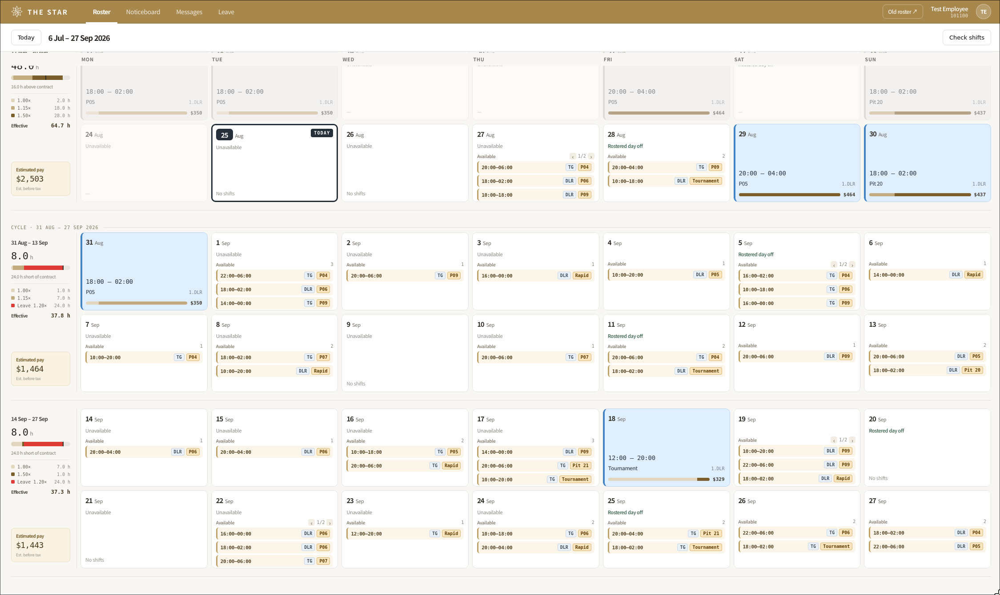
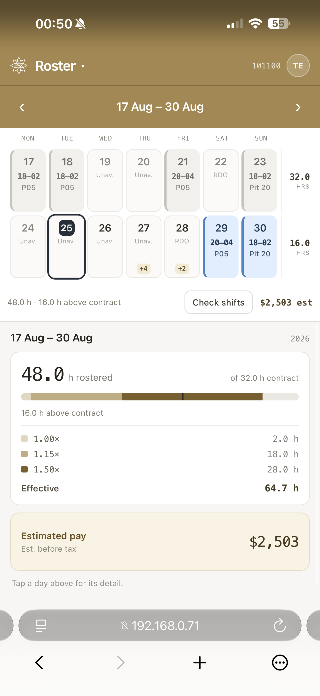

# Roster Extension

A browser extension for [Star Casino's ESS roster portal](https://vr.star.com.au/syd/default.aspx) that replaces the roster with a cleaner redesign and lets you **pick up**, **give away**, and manage shifts directly from the calendar.

> [!IMPORTANT]
> **After installing the extension, bookmark the [roster site](https://vr.star.com.au/syd/default.aspx).** The login can occasionally get interrupted, leaving the page stuck and refusing to load. Refreshing won't help. If you see the error **"Sorry, but we're having trouble signing you in."**, just open your bookmark to load the [roster](https://vr.star.com.au/syd/default.aspx) fresh.

## Screenshots

  

<b>Desktop</b> — redesigned roster with per-shift pay estimates, open shifts, and hover actions

  

<b>Mobile</b> — day tiles with a tap-through detail pane

## Features

The extension replaces the native ESS roster with a cleaner, faster redesign — same data, better view — and adds shift actions you'd otherwise have to dig through menus for.

- **Redesigned roster** — a clear fortnight/cycle calendar that takes over the roster page, on both desktop and mobile layouts.
- **Pick up open shifts** — available shifts show right on each future day (banners on desktop, pills on mobile); a confirmation dialog handles the pickup.
- **Give away shifts** — offer a rostered shift to **anyone** or to a **specific employee ID**. The offered day is marked on the calendar, and you can **cancel** a pending offer in one click.
- **Pay estimates** — every shift shows an estimated pay figure based on your configurable hourly rate.
- **Infinite scroll** — keep scrolling to load future roster cycles.
- **Auto-update check** — an **"Update available"** button appears in the header when a newer release exists.

> [!NOTE]
> **Swap** and **Early Out** appear in the shift actions but aren't wired up yet — they're shown as disabled / "Coming soon".

## Installation

Pick your device below and follow the steps.

  
  &nbsp;
  
  &nbsp;
  

<h3 id="ios">📱 iOS (iPhone / iPad)</h3>

1. Download the latest zip from the [Releases](../../releases/latest) page.
2. Install the [Orion Browser](https://kagi.com/orion/) from the App Store.
3. Tap the **···** button in the bottom corner.
4. Tap **Extensions**, then tap **+**.
5. Tap **Install From File** and select the zip file.

---

<h3 id="android">🤖 Android</h3>

1. Download the latest zip from the [Releases](../../releases/latest) page.
2. Install the [Quetta Browser](https://play.google.com/store/apps/details?id=net.quetta.browser&hl=en_AU) from the Play Store.
3. Open `chrome://extensions`.
4. Toggle **Developer mode** on.
5. Tap **Load unpacked** and select the zip file.
6. Confirm the permissions prompt.

---

<h3 id="desktop">💻 Desktop (Windows / Mac / Linux)</h3>

Choose your browser:

#### Chrome / Edge

1. Download the latest zip from the [Releases](../../releases/latest) page.
2. Unzip the folder somewhere permanent.
3. Go to `chrome://extensions` and enable **Developer mode**.
4. Click **Load unpacked** and select the unzipped folder.

#### Firefox

> **Note:** This method only works on Firefox Developer Edition/Nightly, or third-party Firefox forks such as [Zen Browser](https://zen-browser.app/). Standard release Firefox enforces extension signing and will not allow sideloading.

1. Download the latest zip from the [Releases](../../releases/latest) page.
2. Go to `about:config`, search for `xpinstall.signatures.required` and set it to `false`.
3. Go to `about:addons`, click the gear icon and select **Install Add-on From File**.
4. Select the zip file (do not unzip).

## Updating

The extension checks for new releases and shows an **"Update available"** button in the roster header (top-right) when a newer [release](../../releases/latest) is out — click it to jump straight to the download.

Because the extension is sideloaded rather than installed from a store, updates are **manual**: download the latest zip and reinstall over the old copy. Follow the steps for your device below.

<h3 id="update-ios">📱 iOS (Orion)</h3>

1. Download the latest zip from the [Releases](../../releases/latest) page.
2. Tap the **···** button, then **Extensions**.
3. Remove the existing **Roster Extension**.
4. Tap **+**, then **Install From File** and select the new zip.

---

<h3 id="update-android">🤖 Android (Quetta)</h3>

1. Download the latest zip from the [Releases](../../releases/latest) page.
2. Open `chrome://extensions`.
3. Remove the existing **Roster Extension**.
4. Tap **Load unpacked** and select the new zip.

---

<h3 id="update-desktop">💻 Desktop</h3>

**Chrome / Edge:** download the latest zip, unzip it over the old folder (replacing the files), then go to `chrome://extensions` and click the **↻ reload** icon on the Roster Extension card.

**Firefox:** download the latest zip and reinstall it via `about:addons` → gear icon → **Install Add-on From File** (installing over the existing add-on updates it in place).

